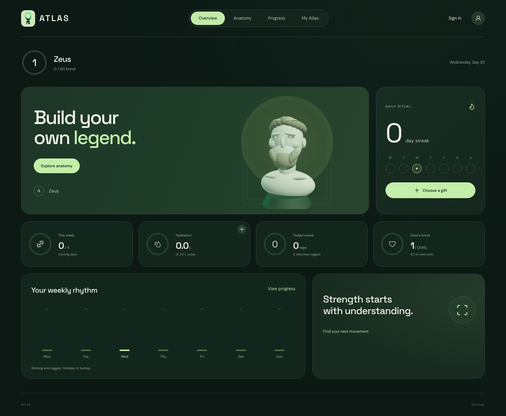

# ATLAS

A strength-training companion built around interactive anatomy, a personal workout journal, and Greek-inspired avatars.



## Features

- **Explore anatomy** — click-to-zoom 3D muscle groups and 28 PDF-referenced exercises.
- **Track progress** — editable workouts, hydration, and daily, weekly, or monthly summaries.
- **Build your bond** — five avatars, daily gifts, independent levels, and collectible rewards.
- **Feel the progress** — animated offerings, live level-ups, and reduced-motion support.
- **Keep your data** — guest browsing, device storage, and validated JSON import/export.
- **Resume safely** — account-scoped workout/profile drafts and server-managed cookie sessions.

## Stack

Next.js · React · TypeScript · Three.js · React Three Fiber · Zod

Optional cloud journal: Supabase Auth + PostgreSQL

Domain logic, rendering, and storage are separate so the web app can grow into a shared mobile platform.

## Get started

Node.js 20.9+ required. Device mode needs no account, API key, or paid service.

```sh
npm ci
npm run dev
```

Open [127.0.0.1:3000](http://127.0.0.1:3000). Choose **Continue on this device** when saving. Browser data is specific to its origin; export a backup before switching devices or URLs.

## Checks

```sh
npm test
npm run typecheck
npm run build
```

For browser checks, start the dev server, then run:

```sh
npx playwright install chromium
npm run test:browser
npm run test:auth
```

Browser tests use an isolated profile. Auth tests start a separate production server and local mock provider; run `npm run build` first. They do not send real emails or validate a hosted database.

## Project structure

```text
src/app/          Routes and styles
src/components/   Screens, interactions, and 3D scenes
src/domain/       Training, avatar, and reward logic
src/lib/          Storage adapters
supabase/         Optional database migration
tests/            Domain and storage tests
scripts/          Browser verification
```

## Status

Working web MVP. Device storage and local drafts are available. Email OTP, HttpOnly sessions, refresh, sign-out, and protected journal APIs are implemented; live Supabase configuration and database verification are still required. Payments, community, and a mobile client are planned, not implemented.

The 3D models are stylized prototypes. Exercise notes are adapted from *Functional Anatomy for Strength Training*, with page references in the catalog; the source PDF is not distributed. Exercise animations and body estimates are educational, not medical guidance.

See [deployment notes](docs/DEPLOYMENT.md) for setup, security boundaries, and release checks.
